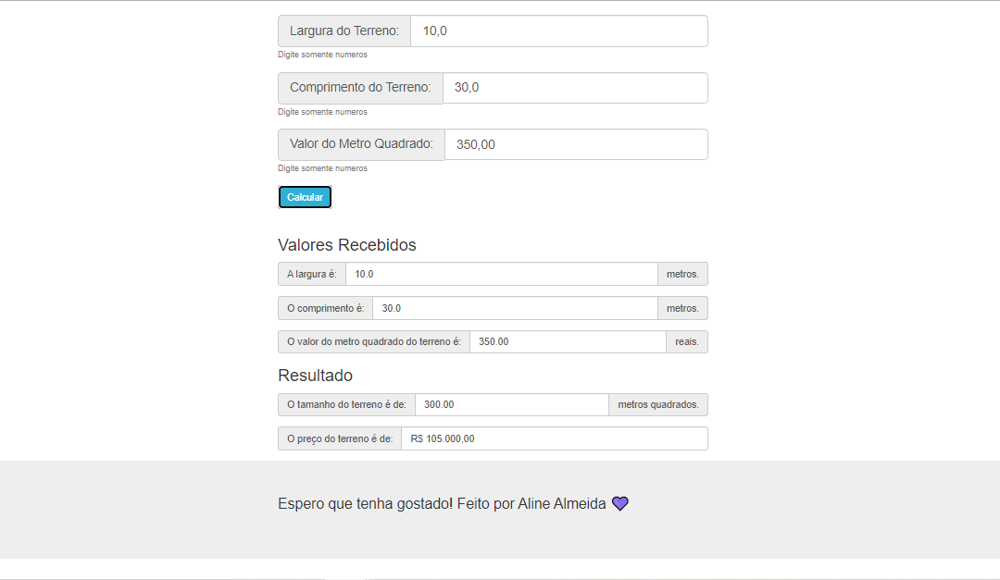

# Jovens Tegranos Exercicio01

### Jovens Tegranos Exercicio 01

# 🏁 Tópicos

 * 👉 Banner
 * 👉 Título e Descrição
 * 👉 Status do Projeto
 * 👉 Funcionalidades
 * 👉 Demonstração da aplicação
 * 👉 Pré-requisitos
 * 👉 Tecnologias utilizadas
 * 👉 Autor
 * 👉 Licença 
 ____________________________________________________________
# ✅ Banner 👌

<h1 align="center">
  
</h1>

# ✅ Título e Descrição 👌

### Título: Exercicio 01

 Descrição: Fazer um programa para ler as medidas da largura e comprimento de um terreno retangular com uma casa decimal, bem como o valor do metro quadrado do terreno com duas casas decimais. Em seguida, o programa deve mostrar o valor da área do terreno, bem como o valor do preço do terreno, ambos com duas casas decimais, conforme exemplo. 

# ✅ Status do Projeto 👌

🚧 Projeto 🚀 Concluído com Sucesso!!! 👌 🚧

# ✅ Funcionalidades 👌

Funcionalidades da aplicação:

- [x] Ler as medidas da Largura do terreno
- [x] ler as medidas do comprimento do terreno
- [x] O valor do Metro quadrado do terreno
- [x] Mostrar o valor da área do terreno
- [x] Mostrar o preço do terreno

# ✅ Demonstração da aplicação 👌

GitHub
AlineAlmeida85

Link: https://alinealmeida85.github.io/Jovens-Tegranos-Exercicio01/

<h1 align="center">
  
</h1>

# ✅ Pré-requisitos 👌

Nenhum, basta clicar no link acima

# ✅ Tecnologias utilizadas ⚒️ 👌

As seguintes tecnologias foram usadas na construção do projeto:

- HTML
- CSS
- JavaScript

# ✅ Autor 👌

Aline Almeida 💝

# ✅ Licença

Não Possui

Espero que te agrade! 💝
